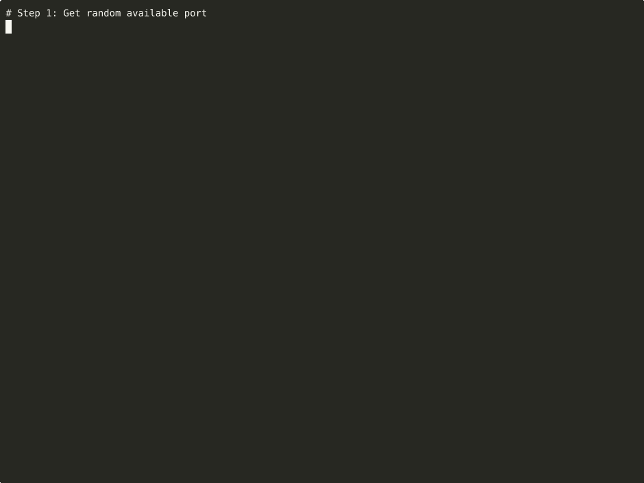

> **Part of [Tuulbelt](https://github.com/tuulbelt/tuulbelt)** — A collection of zero-dependency tools.

# Port Resolver / `portres`

[](https://github.com/tuulbelt/port-resolver/actions/workflows/test.yml)


[](LICENSE)

Concurrent port allocation for any application — avoid port conflicts in tests, servers, microservices, and development environments.

> **Library Composition**: This tool uses [file-based-semaphore-ts](https://github.com/tuulbelt/file-based-semaphore-ts) for atomic registry access, following [PRINCIPLES.md Exception 2](https://github.com/tuulbelt/tuulbelt/blob/main/PRINCIPLES.md). Since all Tuulbelt tools have zero external dependencies, composing them preserves the zero-dep guarantee.

## Problem

Running concurrent processes that need ports often causes "port already in use" errors:

```
Error: listen EADDRINUSE: address already in use :::3000
```

This happens in many scenarios:
- **Parallel tests**: Multiple test files try to use the same hardcoded ports
- **Development environments**: Multiple services started simultaneously
- **Microservices**: Services don't know which ports other services are using
- **CI/CD pipelines**: Concurrent builds running on the same machine
- **Docker/containers**: Random port selection can still collide under high parallelism

**portres** solves this by providing a centralized port registry:
- Each process requests a port from the registry
- The registry ensures ports are unique across all processes
- Ports are automatically released when processes exit
- Works across languages, frameworks, and applications

## Features

- **Zero external dependencies** — Uses only Node.js standard library + Tuulbelt tools
- **File-based registry** — Survives process restarts
- **Contiguous port ranges** — Reserve adjacent ports for microservices clusters
- **Bounded allocation** — Get ports within specific ranges (firewall rules, compliance)
- **Module-level convenience APIs** — Simple `getPort()` and `getPorts()` functions
- **Port lifecycle management** — Track allocations by tag with `PortManager`
- **Batch allocation with rollback** — All-or-nothing semantics for atomic operations
- **Stale entry cleanup** — Automatically removes dead process entries
- **Semaphore-protected registry** — Atomic access via [semats](https://github.com/tuulbelt/file-based-semaphore-ts)
- **Result pattern** — Clear error handling without exceptions
- **CLI and library API** — Use from shell or TypeScript

## Installation

Clone the repository:

```bash
git clone https://github.com/tuulbelt/port-resolver.git
cd port-resolver
npm install  # Installs dev dependencies + auto-fetches file-based-semaphore-ts from GitHub
```

**Zero external dependencies** — uses only Node.js standard library and [file-based-semaphore-ts](https://github.com/tuulbelt/file-based-semaphore-ts) (a Tuulbelt tool with zero external deps).

**CLI names** — both short and long forms work:
- Short (recommended): `portres`
- Long: `port-resolver`

**Recommended setup** — install globally for easy access:

```bash
npm link  # Enable the 'portres' command globally
portres --help
```

For local development without global install:

```bash
npx tsx src/index.ts --help
```

## Usage

### As a Library

**Basic Usage (Class API):**

```typescript
import { PortResolver } from './src/index.ts';

const resolver = new PortResolver();

// Get a single port
const result = await resolver.get({ tag: 'my-test-server' });
if (result.ok) {
  console.log(`Using port: ${result.value.port}`);

  // Start your server on result.value.port

  // Release when done
  await resolver.release(result.value.port);
}

// Get multiple ports at once
const ports = await resolver.getMultiple(3);
if (ports.ok) {
  console.log(`Got ports: ${ports.value.map(p => p.port).join(', ')}`);
}

// Release all ports at end of test suite
await resolver.releaseAll();
```

**v0.2.0 New APIs:**

```typescript
import { getPort, getPorts, PortManager, PortResolver } from './src/index.ts';

// Module-level convenience API (no class instantiation needed)
const port = await getPort({ tag: 'api-server' });
if (port.ok) {
  console.log(`API server port: ${port.value.port}`);
}

// Batch allocation with individual tags
const services = await getPorts(3, {
  tags: ['http-server', 'grpc-server', 'metrics-server'],
});
if (services.ok) {
  console.log('Service ports:', services.value.map(p => `${p.tag}: ${p.port}`));
}

// Reserve contiguous port range (for microservices cluster)
const resolver = new PortResolver();
const cluster = await resolver.reserveRange({
  start: 50000,
  count: 5,
  tag: 'backend-cluster',
});
if (cluster.ok) {
  console.log('Cluster ports:', cluster.value.map(p => p.port).join(', '));
  // Allocated: 50000, 50001, 50002, 50003, 50004 (contiguous)
}

// Get port within specific range (for firewall/compliance requirements)
const apiPort = await resolver.getPortInRange({
  min: 8000,
  max: 9000,
  tag: 'public-api',
});
if (apiPort.ok) {
  console.log(`Public API port (8000-9000): ${apiPort.value.port}`);
}

// Port lifecycle management with PortManager
const manager = new PortManager();
await manager.allocate('frontend');
await manager.allocate('backend');
await manager.allocate('database');

// Access by tag
const frontend = manager.get('frontend');
console.log(`Frontend port: ${frontend?.port}`);

// Release by tag instead of port number
await manager.release('frontend');

// Release all managed ports
await manager.releaseAll();
```

### As a CLI

Using short name (recommended after `npm link`):

```bash
# Get one available port
portres get
# 51234

# Get 3 ports at once
portres get -n 3
# 51234
# 51235
# 51236

# Get port with tag (for identification)
portres get -t my-server --json
# {"port":51234,"tag":"my-server"}

# Release a port
portres release 51234

# Release all ports for current process
portres release-all

# List all allocations
portres list
# Port     PID     Tag             Timestamp
# 51234    12345   my-server       2025-12-29T01:00:00.000Z

# Show registry status
portres status
# Registry Status:
#   Total entries: 1
#   Active entries: 1
#   Stale entries: 0
#   Owned by this process: 1
#   Port range: 49152-65535

# Clean stale entries (dead processes)
portres clean

# Clear entire registry
portres clear

# v0.2.0: Reserve contiguous port range
portres reserve-range -p 50000 -n 5 -t cluster
# Allocated: 50000, 50001, 50002, 50003, 50004

# v0.2.0: Get port within specific range
portres get-in-range --min-port 8000 --max-port 9000 -t api
# 8042
```

## API

### `PortResolver`

Main class for port allocation.

```typescript
const resolver = new PortResolver({
  minPort: 49152,           // Minimum port (default: 49152)
  maxPort: 65535,           // Maximum port (default: 65535)
  registryDir: '~/.portres', // Registry directory
  allowPrivileged: false,   // Allow ports < 1024
  maxPortsPerRequest: 100,  // Max ports per getMultiple()
  maxRegistrySize: 1000,    // Max total entries
  staleTimeout: 3600000,    // Stale entry timeout (1 hour)
});
```

### Methods

**Core Methods:**

| Method | Description |
|--------|-------------|
| `get(options?)` | Get a single available port |
| `getMultiple(count, options?)` | Get multiple ports at once |
| `release(port)` | Release a specific port |
| `releaseAll()` | Release all ports owned by this process |
| `list()` | List all port allocations |
| `clean()` | Remove stale entries |
| `status()` | Get registry status |
| `clear()` | Clear entire registry |

**v0.2.0 New Methods:**

| Method | Description |
|--------|-------------|
| `reserveRange(options)` | Reserve contiguous port range (e.g., 50000-50004) |
| `getPortInRange(options)` | Get any port within specific bounds (e.g., 8000-9000) |

### Module-Level Convenience APIs (v0.2.0)

| Function | Description |
|----------|-------------|
| `getPort(options?)` | Convenience wrapper for single port allocation |
| `getPorts(count, options?)` | Batch allocation with individual tags or shared tag |

### PortManager Class (v0.2.0)

Track and manage port allocations by tag:

| Method | Description |
|--------|-------------|
| `allocate(tag)` | Allocate port and track by tag |
| `allocateMultiple(count, tag?)` | Allocate multiple ports |
| `release(tagOrPort)` | Release by tag or port number |
| `releaseAll()` | Release all managed ports |
| `getAllocations()` | Get all tracked allocations |
| `get(tag)` | Get allocation by tag |

### `isPortAvailable(port, host?)`

Check if a port is available by attempting to bind to it.

```typescript
const available = await isPortAvailable(3000);
if (available) {
  // Port 3000 is free to use
}
```

## Examples

See the `examples/` directory for runnable examples:

```bash
# Fundamentals
npx tsx examples/basic.ts              # Basic usage
npx tsx examples/advanced.ts           # Advanced patterns

# v0.2.0 New APIs
npx tsx examples/parallel-tests.ts     # Parallel test execution patterns
npx tsx examples/batch-allocation.ts   # Module-level APIs (getPort, getPorts)
npx tsx examples/port-manager.ts       # Lifecycle management with PortManager
npx tsx examples/ci-integration.ts     # CI/CD integration patterns
```

See also [CI_INTEGRATION.md](CI_INTEGRATION.md) for comprehensive CI/CD integration guide.

## Testing

```bash
npm test              # Run all tests (125 tests)
npm test -- --watch   # Watch mode
```

**Test breakdown:**
- 79 baseline tests (v0.1.0)
- 27 module-level API tests (getPort, getPorts, PortManager)
- 19 range API tests (reserveRange, getPortInRange)

## Library Composition

**portres** uses [file-based-semaphore-ts](https://github.com/tuulbelt/file-based-semaphore-ts) (`semats`) as a library dependency for atomic registry access. This follows [PRINCIPLES.md Exception 2](https://github.com/tuulbelt/tuulbelt/blob/main/PRINCIPLES.md) — Tuulbelt tools can compose other Tuulbelt tools since they all have zero external dependencies.

The semaphore ensures that concurrent port allocations from multiple processes never corrupt the registry file, even under high parallelism.

## Error Handling

All methods return Result types:

```typescript
type Result<T> =
  | { ok: true; value: T }
  | { ok: false; error: Error };
```

Exit codes:
- `0` — Success
- `1` — Error (invalid input, no ports available, etc.)

## Security

- **Port range validation** — Prevents allocation outside configured range
- **Privileged port protection** — Ports < 1024 require explicit `--allow-privileged`
- **Path traversal prevention** — Registry paths are validated
- **Tag sanitization** — Control characters removed from tags
- **Registry size limits** — Prevents resource exhaustion
- **Secure file permissions** — Registry files created with mode 0600/0700

## Dogfooding

This tool integrates with Tuulbelt's dogfooding strategy:

```bash
# Validate test reliability (local development)
./scripts/dogfood-flaky.sh 10

# Validate output determinism
./scripts/dogfood-diff.sh
```

See [DOGFOODING_STRATEGY.md](./DOGFOODING_STRATEGY.md) for the full composition strategy.


## Demo



**[▶ View interactive recording on asciinema.org](https://asciinema.org/a/oSg2LQQuexnWqmNSdZpuCL6pX)**

> Try it online: [](https://stackblitz.com/github/tuulbelt/port-resolver)

## License

MIT — see [LICENSE](LICENSE)

## Contributing

See [CONTRIBUTING.md](https://github.com/tuulbelt/tuulbelt/blob/main/CONTRIBUTING.md) for contribution guidelines.

## Related Tools

Part of the [Tuulbelt](https://github.com/tuulbelt/tuulbelt) collection:
- [File-Based Semaphore (TS)](https://github.com/tuulbelt/file-based-semaphore-ts) — Cross-platform process locking
- [Test Flakiness Detector](https://github.com/tuulbelt/test-flakiness-detector) — Detect unreliable tests
- [CLI Progress Reporting](https://github.com/tuulbelt/cli-progress-reporting) — Concurrent-safe progress updates
- More tools at [tuulbelt.github.io](https://tuulbelt.github.io/tuulbelt/)
